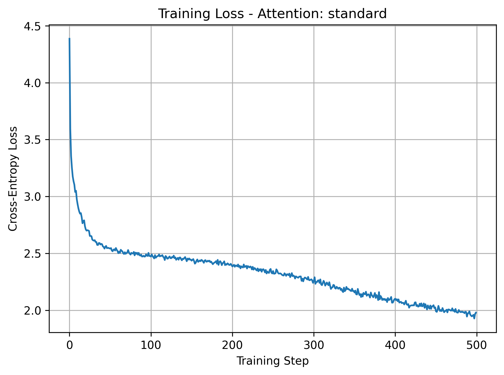
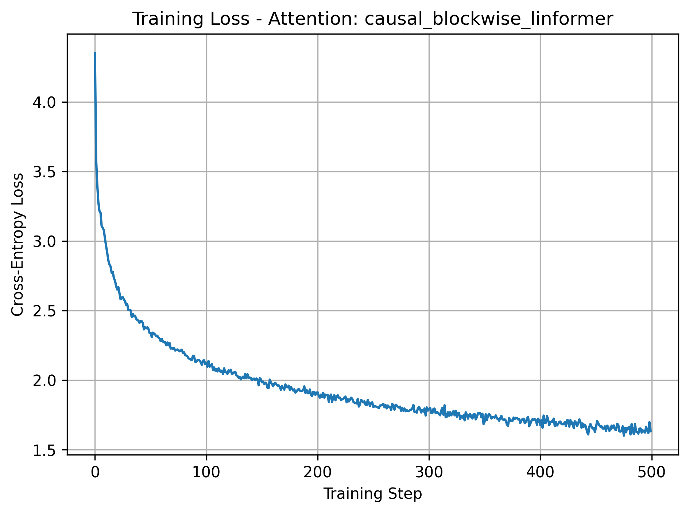

# Causal Blockwise Linformer

A GPT-style character language model implemented from scratch in PyTorch, with a comparison between standard causal self-attention and a causal blockwise Linformer-style attention mechanism.

The main experiment asks whether long-range attention can be replaced with learned causal block summaries while preserving exact local attention for recent tokens.

---

## Features

- Decoder-only GPT-style Transformer
- Character-level language modeling on Tiny Shakespeare
- Standard full causal self-attention baseline
- Causal blockwise Linformer attention variant
- Exact local attention over recent tokens
- Learned blockwise compression for global keys and values
- Validation script for full validation-set loss and perplexity
- Training-loss plots saved automatically under `docs/`

---

## Model Overview

The model supports two attention modes through `config.py`.

### Standard Causal Attention

```python
attention_type = "standard"
```

Standard attention computes full causal self-attention:

$$
O = \operatorname{softmax}\left(\frac{QK^T}{\sqrt{d_h}} + M\right)V
$$

where the causal mask allows position $i$ to attend only to positions $j \le i$.

### Causal Blockwise Linformer Attention

```python
attention_type = "causal_blockwise_linformer"
```

The Linformer variant computes:

$$
O_i = O_i^{\text{local}} + O_i^{\text{global}}
$$

The local branch attends exactly to recent tokens:

$$
\mathcal{L}_i = \{\max(0, i-w+1), \ldots, i\}
$$

The global branch attends to compressed summaries of completed causal blocks:

$$
\mathcal{G}_i = \{a : (a+1)b - 1 \le i\}
$$

A block is only globally visible after the full block is available, which preserves autoregressive causality.

Current Linformer configuration:

```text
block_size          = 256
num_global_blocks   = 64
causal_block_size   = 4
local_window        = 3
```

So a late query attends to at most:

- 3 exact recent token keys
- 64 compressed global block keys

---

## Results

Both attention types were trained with the same model configuration and training loop.

| Attention type | Parameters | Validation loss | Validation perplexity |
| --- | ---: | ---: | ---: |
| Standard causal attention | 10,788,160 | 2.001834 | 7.402619 |
| Causal blockwise Linformer | 10,806,592 | 1.754538 | 5.780778 |

The causal blockwise Linformer adds only **18,432 parameters**, roughly **0.17%** more than the standard model.

In this run, compared with standard attention, the causal blockwise Linformer achieved:

- **12.35% lower validation loss**
- **21.91% lower validation perplexity**

---

## Training Dynamics

<p align="center">
  
  
</p>

<p align="center">
  <em>Left: Standard causal attention &nbsp;&nbsp;&nbsp; Right: Causal blockwise Linformer attention</em>
</p>

---

## Repository Structure

```text
.
├── config.py                  # Hyperparameters and attention selection
├── data.py                    # Dataset loading, encoding, and batching
├── model.py                   # GPT model and attention implementations
├── train.py                   # Training loop and loss plotting
├── val.py                     # Full validation loss and perplexity
├── sample.py                  # Autoregressive text generation
├── tinyShakespeare.txt        # Character-level training dataset
├── docs/                      # Training loss plots
├── MATH_BEHIND_THE_CODE.md    # Mathematical walkthrough
└── README.md
```

---

## Setup

Install dependencies:

```bash
pip install torch matplotlib
```

---

## Train the Model

Choose the attention type in `config.py`:

```python
attention_type = "standard"
# or
attention_type = "causal_blockwise_linformer"
```

Then run:

```bash
python3 train.py
```

This trains the model, saves weights as `model.pth`, and saves a timestamped training-loss plot under `docs/`.

---

## Validate the Model

```bash
python3 val.py
```

The validation script loads `model.pth`, checks that the checkpoint attention type matches `config.py`, and reports:

- parameter count
- attention type
- validation loss
- validation perplexity

---

## Generate Samples

```bash
python3 sample.py
```

This loads the trained checkpoint and generates text autoregressively from the prompt in `sample.py`.

---

## Key Concepts Implemented

### Causal Masking
Ensures each position can only use current and past tokens.

### Exact Local Attention
Preserves high-resolution access to recent tokens, which is important for short-range syntax and character-level patterns.

### Blockwise Key/Value Compression
Compresses keys and values inside completed causal blocks using learned projection weights `E` and `F`.

### Causal Global Summaries
A query can attend to a compressed block only after that block has fully ended. This avoids future-token leakage during both training and generation.

### Standard vs Compressed Global Attention
The standard baseline attends to all previous token keys directly. The Linformer variant attends to recent tokens exactly and long-range context through compressed block summaries.

---

## Notes

This is a correctness-first implementation. The local branch currently uses dense masked attention for simplicity, even though mathematically it represents a sliding local window. The global branch uses learned blockwise compression and respects autoregressive causality.

For a detailed mathematical walkthrough of the architecture, tensor shapes, masks, complexity, and parameter counts, see [`MATH_BEHIND_THE_CODE.md`](MATH_BEHIND_THE_CODE.md).

---

## Future Improvements

- Replace dense masked local attention with a true sliding-window implementation
- Add timing and memory benchmarks for both attention types
- Train for longer and compare generation quality
- Evaluate on larger datasets and longer context lengths
